# Advanced RAG Web Crawler & Chatbot

> "A state-of-the-art Retrieval-Augmented Generation (RAG) system that combines intent classification and dynamic pipeline selection to deliver fast, accurate, and context-aware responses."

In an era of information overload, our RAG Web Crawler & Chatbot redefines how users interact with data. By integrating Gemini 1.5 Pro's massive context window, Pinecone's high-performance vector indexes, and FastAPI optimizations, this system achieves sub-100 ms query routing and response generation at scale. Whether it's answering complex queries or maintaining conversational context, this project pushes the boundaries of AI-driven retrieval systems.

## 😊 Demo Video:
[](https://www.youtube.com/watch?v=7H3CFDmschA)

## 🚀 Key Features

1. **Intent Intelligence**  
   Dynamically routes each incoming request to the optimal service based on real-time intent analysis, ensuring precision handling for every query.

2. **High Performance**  
   Scales horizontally with a backend engineered for sub-100 ms end-to-end latency, even under high concurrency.

3. **Conversational Memory**  
   Maintains dialogue context across turns and sessions, enabling seamless, stateful interactions without losing track of prior information.

4. **AI-Powered Web Scraping**  
   - **Automated Extraction**: Uses NLP and computer-vision models to detect and pull structured data (tables, lists, metadata) from any public website.  
   - **Adaptive Selectors**: Learns page layouts and self-heals against template changes, reducing maintenance overhead.  
   - **Compliance-Aware Crawling**: Respects `robots.txt`, rate limits requests, and includes built-in proxy rotation.  
   - **Data Normalization**: Cleans, deduplicates, and outputs scraped data in JSON, CSV, or your custom schema.  
 

## 🏗️ System Architecture

### Backend (FastAPI)
- **API Layer**: RESTful endpoints for crawling, querying, and chat
- **Core Services**: 
  - Crawl Service: Web content extraction and processing
  - Query Service: Vector search and document retrieval
  - Chat Service: LLM integration and response generation
- **Vector Store**: Pinecone integration for document storage and retrieval
- **LLM Integration**: meta-llama/Llama-2-7b-chat-hf for text generation

### Frontend (Streamlit)
- **Web Crawler Tab**: Interface for URL submission and crawling
- **RAG Chatbot Tab**: Chat interface with conversation history
- **Knowledge memory Visualizer**: Interactive memory exploration
- **Sidebar**: Application information and session details
- **Custom Styling**: Modern, responsive dark theme UI

## 🔗 Vector Hybrid Search Workflow

A seamless process for retrieving and generating responses.

```mermaid
flowchart TB
    %% Main flow nodes with icons
    A["🔍 Intent Detection"]:::blue
    B["🧠 Pipeline Selection"]:::green
    C["🔎 Retrieval"]:::orange
    D["💬 Response Generation"]:::red
    E["📤 Response Delivery"]:::teal

    %% Connections
    A --> B
    B --> C
    C --> D
    D --> E

    %% Detailed subprocesses as small nodes
    B1["Filtering Pipeline"]:::greenLight
    B2["Vector Pipeline"]:::greenLight
    B --> B1 & B2 --> C

    C1["Pinecone Vector Search"]:::orangeLight
    C2["Regex/Entity Filters"]:::orangeLight
    C --> C1 & C2 --> D

    D1["Prompt Engineering"]:::redLight
    D2["Gemini 1.5 Pro"]:::redLight
    D --> D1 --> D2 --> E

    E2["Final Formatting"]:::tealLight
    E --> E2

    %% Styling classes
    classDef blue fill:#1890ff,color:white,stroke:#005bb5,stroke-width:2px
    classDef green fill:#52c41a,color:white,stroke:#389e0d,stroke-width:2px
    classDef orange fill:#fa8c16,color:white,stroke:#d46b08,stroke-width:2px
    classDef red fill:#f5222d,color:white,stroke:#cf1322,stroke-width:2px
    classDef teal fill:#13c2c2,color:white,stroke:#08979c,stroke-width:2px
    
    classDef greenLight fill:#f6ffed,color:#52c41a,stroke:#b7eb8f,stroke-width:1px
    classDef orangeLight fill:#fff7e6,color:#fa8c16,stroke:#ffd591,stroke-width:1px
    classDef redLight fill:#fff1f0,color:#f5222d,stroke:#ffa39e,stroke-width:1px
    classDef tealLight fill:#e6fffb,color:#13c2c2,stroke:#87e8de,stroke-width:1px
```




## 🚀 Getting Started

### Prerequisites

- Python 3.8+
- Docker & Docker Compose (optional for containerized setup)
- API Keys:
  - Hugging face access token
  - Pinecone API
  - (Optional) Additional crawler API keys

### Installation

#### 1. Clone the repository

```bash
git clone https://github.com/yourusername/rag-web-crawler-chatbot.git
cd rag-web-crawler-chatbot
```

#### 2. Environment Setup

**Option A: Using virtual environment**

```bash
# Create and activate virtual environment
python -m venv venv
source venv/bin/activate  # Linux/Mac
# or
.\venv\Scripts\activate   # Windows

# Install dependencies
pip install -r requirements.txt
```

**Option B: Using Docker**

```bash
# Build the Docker image
docker-compose build

# Start the containers
docker-compose up -d
```

#### 3. Configuration

Create a `.env` file in the project root:

```env
# API Keys
HUGGINGFACE_KEY=your_huggingface_api_key
PINECONE_API_KEY=your_pinecone_api_key

# Vector Database Settings
PINECONE_INDEX_NAME=rag
PINECONE_ENVIRONMENT=us-west1-gcp
EMBEDDING_MODEL=intfloat/e5-base-v2

# LLM Settings
LLM_MODEL=meta-llama/Llama-2-7b-chat-hf
MAX_TOKENS=8192
TEMPERATURE=0.1

# Text Processing
CHUNK_SIZE=512
CHUNK_OVERLAP=50
SIMILARITY_TOP_K=5

# Server Settings
PORT=8000
HOST=0.0.0.0
DEBUG=False

# Application Settings
CACHE_DIR=./cache
LOG_LEVEL=INFO
```

#### 4. Initialize Pinecone Index

```bash
python scripts/init_pinecone.py
```

### Running the Application

#### Option A: Running services individually

1. Start the FastAPI backend:
```bash
python main.py
```

2. Start the Streamlit frontend:
```bash
streamlit run app.py
```

#### Option B: Using Docker Compose

```bash
docker-compose up
```

### Accessing the Application

- **FastAPI Backend**: http://localhost:8000
- **API Documentation**: http://localhost:8000/docs
- **Streamlit Frontend**: http://localhost:8501

## 🔍 Advanced Intent Classification & Routing

Understand and route user queries with precision using a sophisticated intent classification engine.

- **Multi-label Intent Taxonomy**  
  - Tags queries against 30+ intent classes (e.g., "factual_lookup", "comparative_search", "actionable_insight")
  - Uses a fine-tuned classifier for accurate intent detection

- **Dynamic Pipeline Orchestration**  
  - **Filter Pipeline**: High-precision regex and entity filters for FAQs and rule-based intents
  - **Vector Search Pipeline**: Sub-millisecond ANN retrieval with Pinecone's HNSW indexes


## ⚡ High-Performance Backend & Indexing

Scalable infrastructure for lightning-fast responses.

| Technology | Role         | Key Features                                              |
|------------|--------------|-----------------------------------------------------------|
| Streamlit  | Frontend     | Dark-mode UI, real-time chat, graph visuals               |
| FastAPI    | Backend      | Async endpoints, 10K+ req/sec, <50 ms latency             |
| Pinecone   | Vector Store | P2 indexes, 100M+ vectors, 15 ms ANN lookups              |

## 🤝 Conversational Memory & Context

Maintain seamless interactions with advanced memory management.

- **Hierarchical Session Memory**  
  - Short-term buffers and long-term summaries via LangChain's ConversationSummaryMemory
- **Contextual Re-ranking**  
  - Leverages Gemini 1.5 Pro's 1M-token context window for cross-document reasoning
- **Adaptive Prompt Engineering**  
  - Dynamic JSON prompts for tailored LLM outputs

## 📚 API Endpoints

### /api/crawl
- **Method**: POST
- **Purpose**: Crawl and index web content
- **Request Body**:
  ```json
  {
    "url": "https://example.com",
    "depth": 2,
    "max_pages": 50
  }
  ```
- **Response**: Crawl statistics and status

### /api/query
- **Method**: POST
- **Purpose**: Search indexed content
- **Request Body**:
  ```json
  {
    "query": "How does hybrid retrieval work?",
    "top_k": 5
  }
  ```
- **Response**: Relevant document chunks

### /api/chat
- **Method**: POST
- **Purpose**: Chat with RAG system
- **Request Body**:
  ```json
  {
    "message": "Tell me about GraphRAG",
    "conversation_id": "12345"
  }
  ```
- **Response**: AI-generated responses

## 📂 Project Structure
```
rag-web-crawler-chatbot/
├── api/
│   ├── routes.py
│   ├── schemas.py
│   └── dependencies.py
├── core/
│   ├── crawler.py
│   ├── embeddings.py
│   ├── llm.py
│   ├── knowledge_graph.py
│   └── text_processing.py
├── services/
│   ├── crawl_service.py
|   ├── intent_detection_service.py
│   ├── query_service.py
│   └── chat_service.py
├── ui/
│   ├── pages/
│   ├── components/
│   └── utils/
├── config/
│   └── settings.py
├── scripts/
│   ├── init_pinecone.py
├── tests/
│   ├── unit/
│   └── integration/
├── docker-compose.yml
├── Dockerfile
├── main.py
├── app.py
├── requirements.txt
└── README.md
```

## 🤝 Contributing

1. Fork the repository
2. Create a feature branch (`git checkout -b feature/amazing-feature`)
3. Commit your changes (`git commit -m 'Add some amazing feature'`)
4. Push to the branch (`git push origin feature/amazing-feature`)
5. Open a Pull Request
